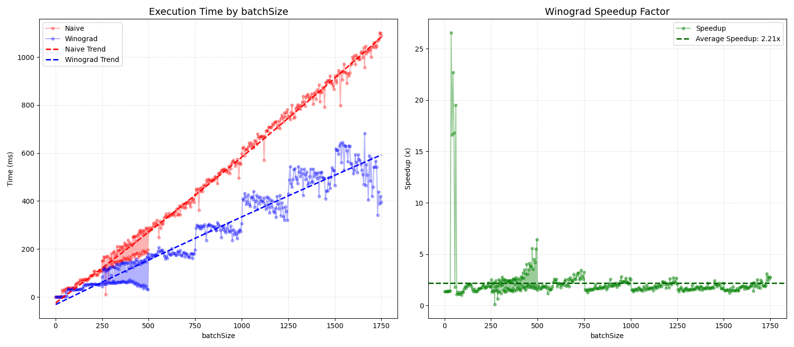
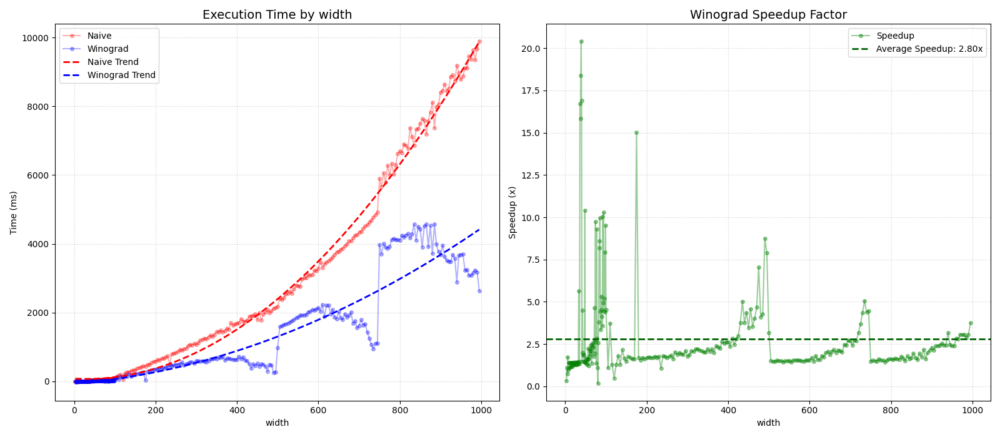
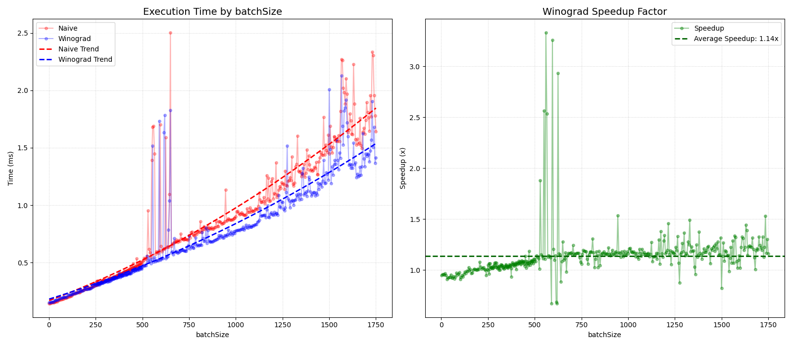
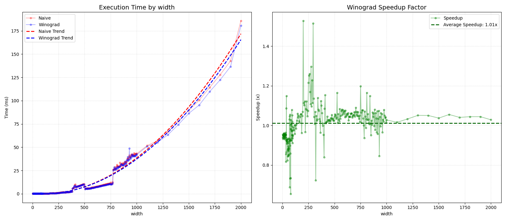
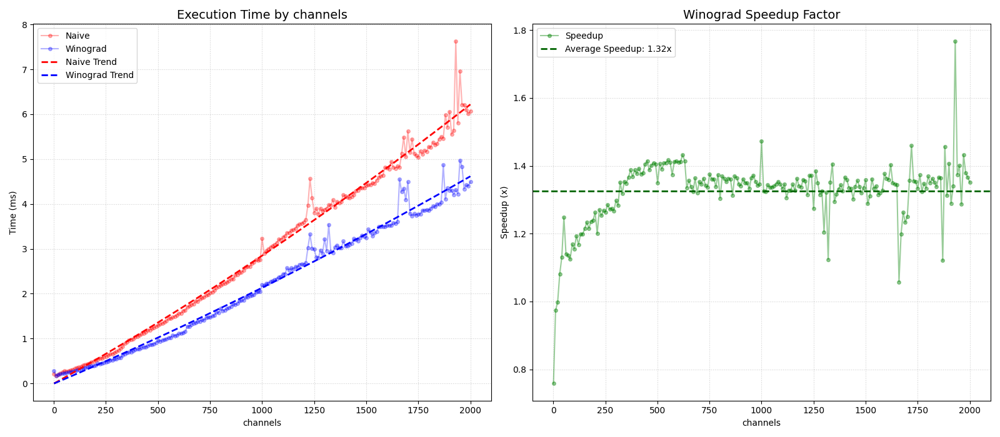

# Быстрая свертка по методу Шмуэля Винограда

Выполнил Галицын Матвей (ФРКТ, группа Б01-411)

Вот [здесь](3_win.pdf) можно ознакомиться с заданием.

Реализованы наивный алгоритм и алгоритм Винограда (ядро 3 x 3, выход 2 x 2) свертки тензора. Далее опишем 
более подробно каждый из подходов. Можете посмотреть как я их реализовал [здесь](tensor/src/tensor_conv.cppm).

## Наивный алгоритм

Для выходящего пикселя берется тайл, размер которого эквивалентен размерам ядра. Каждый слой такого тайла
 выполняет поэлементное умножение на соответствующий слой ядра (происходит так называемое поканально умножение).
Далее полученные слои складываются друг с другом. Далее складываются все элементы получившегося слоя. Ну обственно
 это и есть значние нового пикселя. Далее тайл "двигается". Так проделывается для каждого пикселя для каждой картинки
 батча.

## Алгоритм Винограда

Конкретно в коде реализована схема $F(2, 3)$, которая вычисляет блок выхода $2 \times 2$ с использованием ядра $3 \times 3$ и входного тайла $4 \times 4$. Далее я описываю алгоритм для одного слоя, аналогично он повторяется для всех слоев. Вместо того чтобы честно перемножать всё подряд, алгоритм переводит входные данные и ядро в «пространство Винограда» с помощью специальных матриц трансформации ($G, B, A$).  
Трансформация ядра делается один раз для всего тензора (или батча, вообщем тензора из картинок), формула: $transformedKernelLayer = G \cdot kernelLayer \cdot G^T$. Сообственно в коде это явно прописано `Layer<ValT> transformedKernelLayer = G.mul_matrix(kLayer).mul_matrix(GT);`  
Далее происходит трансформация тайла, формула аналогичная $transformedInput = B^T \cdot tile \cdot B$, в коде прямо так и прописано `Layer<ValT> transformedInput = BT.mul_matrix(tile).mul_matrix(B);`  
Далее происходит самое важное, а именно поэлементное умножение,
$M = transformedKernelLayer \odot transformedInput$ (код: `Layer<ValT> M = transformedKernel[channel_idx].mul_elementWise(transformedInput);`), именно тут происходит основная экономия вместо 36 умножений ($4 \text{пикселя} \times 9 \text{ умножений} = 36$ умножений) мы получаем 16 умножений (поэлементное умножение), что конечно же радует.  
В конце происходит обратная трансформация, $Y = A^T \cdot M \cdot A$ (код: `Layer<ValT> result = AT.mul_matrix(accumulateLayer).mul_matrix(A);`)  
Важно также отметить, что тайл двигается на 2 шага вперед, а не на 1, как это делает наивный подход.


## Анализ результатов

### CPU

Сначала будем варьировать размер батча. Заметные выбросы speedup на границах объясняются методом сбора данных: замеры производились отдельными файлами по диапазонам, которые затем склеивались. (кэш каждый раз вначале был
 холодным)



Алгоритм Винограда демонстрирует среднее ускорение в 2.21x, что является отличным результатом для подобных оптимизаций. Относительное плато наступает после batchSize = 750. Если посмотреть на правый график, после этой отметки линия Speedup стабилизируется и колеблется в узком коридоре около значения 2.0x. Это означает, что вычислительная сложность обоих алгоритмов начала расти линейно и пропорционально, а выигрыш за счет уменьшения числа операций стал константным.

Теперь посмотрим зависимость от размера матрицы (тензоры все квадратные в данном случае)




При свёртке сложность растёт как O(W² · kH · kW · Ch), поскольку ширина и высота меняются одновременно. Площадь тензора квадратична по ширине, а значит оба алгоритма дают параболу. Тренды хорошо ложатся на квадратичную аппроксимацию. При увеличении размера тензора внутренний цикл по тайлам становится доминирующим, и разница в эффективности чтения кэш-линий накапливается на каждом тайле по всей площади тензора. Чем больше тензор, тем больше тайлов, тем заметнее суммарный выигрыш. Так как я храню слои одним вектором, то получается так, что 
виноград за раз берет 4 элемента, а наивная 3. Значит коэффициент увеличения по сравнению с кофиициентом увеличения батчей возрастет примерно в 1.3 - 1.7 раз (16 / 9 ≈ 1.7, 4 / 3 ≈ 1.3) в теории. Видим что здесь средний speedup стал ≈ 2.8

### GPU

Ядра для обоих алгоритмах я писал на OpenCL.





Оба алгоритма одинаково хорошо параллелятся по [(x, y, batch) в NDRange](tensor/src/tensor_conv.cppm). GPU загружен в обоих случаях одинаково. А разница между ними только в том сколько умножений происходит внутри одного work-item — и это сокращение просто теряется на фоне того что GPU и так гоняет тысячи work-items параллельно по батчу.

При увеличении числа каналов преимущество алгоритма Винограда становится заметнее, так как в данной реализации параллелизация по каналам отсутствует, и выигрыш от уменьшения числа операций проявляется сильнее.



## Клонирование, сборка и запуск

### Зависимости проекта

- CMake 3.28+ (поддержка модулей)
- Ninja
- LLVM/Clang
- Python (запускалось на версии 3.13.7)
- PyTorch, Tqdm, Matplotlib, NumPy

Обратите внимание, что проект содержит сабмодули:

- [nlohmann_json](https://github.com/nlohmann/json) (легковесная header-only библиотека для работы с `json` и `ndjson` в C++)

- [cxxopts](https://github.com/jarro2783/cxxopts) (библиотека для парсинга аргументов командной строки)

```bash
# Клонировать надо рекурсивно:
git clone --recurse-submodules link

cd SberWinograd
```

### Сборка

```bash
# Генерируем систему сборки с помощью Ninja 
# Компилятор clang++, так как g++ плохо поддерживает модули

cmake -G=Ninja -S . -B build -DCMAKE_CXX_COMPILER=clang++

cmake --build build 
```

В папке `build/` будут два исполняемых файла: `winograd` и `winograd_compare`. 

### Запуск

Основной исполняемый файл:

```bash
# На вход подаем json файл c входными тензорами и ядрами (формат смотрите ниже)
# На выходе json файлы с тензорами-свертками (если не подан выходной 
# файл, то будет дамп в терминал)

./build/winograd --source=<path/to/input.json> [--output=<path/to/output.json>]

# Можно вывести help (в нем все описано)

./build/winograd --help
```

Перформанс тестирование (cравнение наивной реализации и алгоритма Винограда):

```bash

# Также обязательно подаем json файл c входными тензорами и ядрами
# По умолчанию дамп будет производиться в out.ndjson, однако можно передать свой файл
# ОБРАТИТЕ ВНИМАНИЕ ЛУЧШЕ ВСЕГО РАСШИРЕНИЕ ndjson
# winograd_compare не зачищает содержимое файла, он ДОЗАПИСЫВАЕТ ЧАНКИ (собственно поэтому ndjson)
# Поэтому очищать файл нужно самому

./build/winograd_compare --source=<path/to/input.json> [--output=<path/to/output.ndjson>]

```

Для чего так было сделано? Сами тесты очень тяжелые в плане расхода оперативки, не возможно просто взять
 и обработать все одним проходов, поэтому бьем чанки (далее покажу как это их генерирует питон). Ниже написал пример,
 сами тесты (test5_1-500.json, test5_500-1000.json, test5_1000-1500.json) я не прикладываю, они объемные. Цифры например 
1-500 означает например варьирующийся размер одного батча.

```bash
./build/winograd_compare -s=test5_1-500.json -o=test5_batchSize.ndjson
./build/winograd_compare -s=test5_500-1000.json -o=test5_batchSize.ndjson
./build/winograd_compare -s=test5_1000-1500.json -o=test5_batchSize.ndjson
```

Итак, на выходе (test5_batchSize.ndjson) будет что-то типо такого:

```json
{"input":{"batchSize":1,"channels":3,"height":10,"width":10},"kernel":{"height":3,"width":3},"naive_ms":0.039593,"speedup":1.3914739579672455,"winograd_ms":0.028454}
{"input":{"batchSize":6,"channels":3,"height":10,"width":10},"kernel":{"height":3,"width":3},"naive_ms":0.238355,"speedup":1.3677575215043583,"winograd_ms":0.174267}
{"input":{"batchSize":11,"channels":3,"height":10,"width":10},"kernel":{"height":3,"width":3},"naive_ms":0.445432,"speedup":1.3669890041092654,"winograd_ms":0.325849}
{"input":{"batchSize":16,"channels":3,"height":10,"width":10},"kernel":{"height":3,"width":3},"naive_ms":0.664337,"speedup":1.3982686260560624,"winograd_ms":0.475114}
{"input":{"batchSize":21,"channels":3,"height":10,"width":10},"kernel":{"height":3,"width":3},"naive_ms":0.871647,"speedup":1.3924807537777548,"winograd_ms":0.625967}
{"input":{"batchSize":26,"channels":3,"height":10,"width":10},"kernel":{"height":3,"width":3},"naive_ms":1.088706,"speedup":1.4058413049317162,"winograd_ms":0.774416}
```

Собственно в каждой строке предоставляются характеристики входного тензора и ядра, а также `naive_ms` - время свертки наивной версии, `winograd_ms` - время свертки алгоритма Винограда и `speedup` = `naive_ms` / `winograd_ms`

### Формат входного/выходного json

В `tensors` идут последовательно входной тензор, ядро, входной тензор, ядро, ...

```json
{
    "tensors": [
        {
            "height": 3,
            "width": 4,
            "channels": 3,
            "batchSize": 2,
            "layers": [
                [1, 2, 3, 4, 5, 1, 1, 2, 3, 4, 5, 1],
                [3, 2, 12, 10, 1, 1, 1, 2, 3, 4, 5, 1],
                [1, 2, 3, 4, 5, 6, 1, 2, 3, 4, 5, 1], 

                [1, 2, 3, 4, 5, 1, 1, 2, 3, 4, 5, 1],
                [3, 2, 12, 10, 1, 1, 1, 2, 3, 4, 5, 1],
                [1, 2, 3, 4, 5, 6, 1, 2, 3, 4, 5, 1]
            ]
        },
        {
            "height": 3,
            "width": 4,
            "channels": 3,
            "batchSize": 1,
            "layers": [
                [1, 2, 3, 4, 5, 1, 1, 2, 3, 4, 5, 1],
                [3, 2, 12, 10, 1, 1, 1, 2, 3, 4, 5, 1],
                [1, 2, 3, 4, 5, 6, 1, 2, 3, 4, 5, 1]
            ]
        },

        {
            ...
        }
    ]
}
```

На выходе идут последовательно свертки входных тензоров для каждой пары.

## Перформанс генератор и генератор обычных тестов

Генератор тестов [test_generator.py](test_generator.pys) на выходе отдает формат аналогичной сверху.
 Только будет сгенерировано помимо входного тензора и ядрв еще какая должна быть свертка на выходе, сгенерированная 
 с помощью pyTorch.

Я не вижу смысла делать передачу парметров, проще сразу менять в самом коде:

```python

# change parameters here
batch_size = 2
in_channels = 4
height, width = 100, 100
k_size = 3

```

Перформанс генератор [performance_generator.py](performance_generator.py) спамит парами входной тензор и 
ядро. Можно менять практический любой параметр тензора:

```python
start_size = 10
end_size = 10
step_size = 20

start_batch = 750
end_batch = 750
step_batch = 5

start_in_channels = 3
end_in_channels = 3
step_in_channels = 1

kernel_size = 3
```

Пожалуйста обратите внимание на (это та самая проблема, которую я описывал выше):

```python
print(f"When selecting the maximum number of chunk pairs in a single file, please bear in mind your computer’s RAM capacity, as well as the size of the tensors themselves. I recommend checking the system monitor when you first run the programme to keep an eye on RAM usage. If the system becomes overloaded, terminate the programme immediately; otherwise, everything will freeze.")

generate_and_save_chunks(
    chunk_size=200,
    filename_prefix="test5",
    device=None
)
```

## Построить график по данным

Собственно передаем сгенерированный ndjson и параметр по которому мы исследуем перформанс.

```bash
python3 plotter.py batchSizeTest/test5_batchSize.ndjson batchSize
```

## Тестирование корректности алгоритмов и программы в целом

Для тестирования я взял свой небольшой фреймворк написанный ранее в проектах. Посмотреть его описание и возможности
 можно в этом проекте или тут: [BitonicSort](https://github.com/Matvey787/BitonicSort/tree/llvm-opts/tests/tester)

Тестирование проводилось с помощью gtest (unit) и ctest (e2e)
